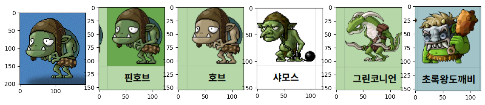

# mapleland_speed_quiz_breaker

메이플랜드 (메랜) 카산드라 스피드퀴즈 검색 툴

## Why?

최근 (25년 4 ~ 5월) 메랜에서 스피드퀴즈 이벤트를 하는데, 메이플에 존재하는 NPC, 몬스터 등 모든 캐릭터 이름을 10초 안에 총 50문제 맞추는 이벤트를 하고 있다.
그런데, 정답 수에 따라 얻을 수 있는 경험치가 많이 차이 나고 40문제 이상을 맞추면 40% 이상 경험치를 얻을 수 있다. (레벨 80 이하 기준)

정답을 모아둔 족보 사이트가 존재하는데, 10초 안에 웹 페이지나 구글 스프레드 시트를 스크롤 하면서 찾기가 번거롭고 생각보다 어려웠다.
그래서, 자동으로 화면에서 퀴즈 창 안 캐릭터를 인식하고 검색해주는 무언가를 만들면 편하지 않을까 해서 만들어 봄

## How?

정확하게 텍스트 형태의 정답을 주는 게 아니라 이미지 형태 (캐릭터 + 이름이 포함된 이미지)를 검색해 주고 매번 스크린 샷을 해야 합니다.

더 편한 사용성을 위해서 작업을 더 하려 했는데, 귀찮아서 적당히 (제가) 쓰기 편한 형태로만 했습니다.

동작 방식은 아래와 같다.

1. 스피드퀴즈가 등장하면 화면을 스크린샷 한다.

2. 위와 같이 찍히고, 메랜 스크린샷 폴더에 이미지로 저장된다. (e.g. `C:\\Users\[계정 명]\Pictures\MapleStory Worlds`). (주의: 계정명은 영어를 권장합니다.)

3. 스크린샷에서 퀴즈가 존재하는 영역을 탐지하고 캐릭터만 깔끔하게 자른다. (관련 로직인 `sqb/tools.py` -> `extract_character()`, `remove_empty_area()` 참고)

4. 반자동으로 수집한 족보 데이터에서 해당 캐릭터와 가장 유사한 이미지 5개를 검색한다.

5. 이미지 5개를 사용자에게 보여주면, 사람이 이미지를 보고 정답을 적는다.

## Requirement

* Python3 (3.10 이상 권장)
* GPU 권장 (CPU도 가능은 함)
* jupyter notebook 필요
* dependencies는 `pyproject.toml` 또는 `requirements.txt` 참고
    * numpy = "^2"
    * torch
    * opencv-python = "^4.11"
    * open_clip_torch = "*"
    * matplotlib = "*"
    * tqdm = "*"

## Usage

1. `git clone https://github.com/kozistr/mapleland_speed_quiz_breaker`
2. `cd mapleland_speed_quiz_breaker` 하고 `jupyter notebook` 실행
3. `search.ipynb` 열기
4. 6번 째 cell에 `test_path` 변수를 자신 환경에 맞게 수정 (중간에 계정 명만 바꾸면 됩니다. e.g. `test_path = r'C:\\Users\zero\Pictures\MapleStory Worlds'`)
5. 7번 째 cell (검색하는 부분)을 제외하고 모두 순차적으로 실행합니다.
6. 이제 준비 완료. 스피드퀴즈를 시작합니다.
7. 문제가 나오면 스크린캡쳐를 하고 7번 cell을 한번 실행해 줍니다.
8. 그러면, 4 ~ 500ms 정도 후에 아래와 같이 검색 결과가 나옵니다.

9. 가장 왼쪽이 query image (퀴즈 문제), 왼쪽 부터 가장 유사한 이미지 순 입니다. 대부분은 top 3안에 정답이 있습니다. (가끔 못 찾거나 짤린 경우도 있는데, `부기` 등등, 알잘딱깔센 해 줍니다.)
10. 이제 메랜 화면으로 다시 돌아가서 정답을 입력합니다.
11. 7번 돌아가서 끝날 때까지 반복
12. profit!

### 셀프 A/S

만약 정답에 추가하고 싶은 데이터가 있다면, `character_images/26` 폴더에 이미지 파일로 저장해 주세요.

### 손가락 복잡도

`O(5)`

1. Psc (스크린 캡쳐)
2. alt+tab
3. cell 7 마우스 한번 클릭
4. enter
5. alt+tab

## 성과

거의 매일 48개 이상은 맞추고 있습니다.

## Directory Tree

* `character_images/`: 족보
* `tests/`: 테스트 및 warmup용 이미지
* `sqb/`: 소스코드
* `search.ipynb`: 검색 코드 (핵심)
* `split_gt_images.ipynb`: 반자동으로 데이터 셋 생성한 스크립트 (`character_images/`에 데이터 생성함)
* `*.ipynb`: 실험용 코드
